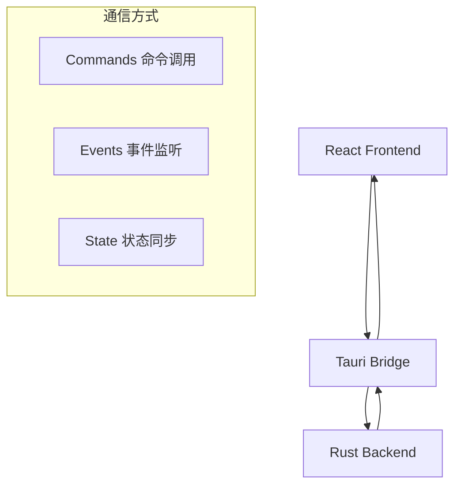

# 前后端通信

CrossCopy 基于 Tauri 框架，采用其提供的高效通信机制，实现前端 React 应用与后端 Rust 代码的无缝交互。通过类型安全的 API 设计和事件驱动的架构，确保了前后端数据的一致性和实时性。

## 通信架构

### 1. 通信模型概览

CrossCopy 的前后端通信基于以下三种核心模式：



### 2. 命令调用 (Commands)

**特点**:
- 前端通过 `invoke` 调用后端函数
- 支持异步操作和完整的错误处理
- 用于数据查询、操作触发和配置更新
- 支持参数验证和类型安全

**使用场景**:
- 获取剪贴板历史记录
- 连接/断开设备
- 更新应用设置
- 执行文件操作

### 3. 事件监听 (Events)

**特点**:
- 后端通过 `emit` 向前端发送事件
- 前端通过 `listen` 监听特定事件
- 支持事件过滤和批量处理
- 用于实时状态更新和通知

**使用场景**:
- 剪贴板内容变化通知
- 设备连接状态变化
- 同步进度更新
- 错误和警告通知

### 4. 状态同步 (State)

**特点**:
- 使用 Tauri 状态管理 API
- 在前后端之间共享应用状态
- 支持状态持久化和恢复
- 确保 UI 与后端状态的一致性

**使用场景**:
- 应用配置状态
- 设备连接状态
- 用户界面状态
- 缓存数据管理

## 核心 API 设计

### 1. 后端命令定义 (Rust)

#### 剪贴板相关命令

```rust
use serde::{Deserialize, Serialize};
use tauri::State;

// 数据结构定义
#[derive(Debug, Serialize, Deserialize, Clone)]
pub struct ClipboardItem {
    pub id: String,
    pub content: ClipboardContent,
    pub timestamp: i64,
    pub source_device: String,
    pub content_type: String,
    pub size: usize,
    pub is_favorite: bool,
}

#[derive(Debug, Serialize, Deserialize, Clone)]
pub enum ClipboardContent {
    Text(String),
    Image(Vec<u8>),
    File(String),
    Html(String),
}

// 获取剪贴板历史
#[tauri::command]
pub async fn get_clipboard_history(
    limit: Option<usize>,
    filter: Option<String>,
    app_state: State<'_, AppState>,
) -> Result<Vec<ClipboardItem>, String> {
    let clipboard_manager = app_state.clipboard_manager.lock().await;

    match clipboard_manager.get_history(limit.unwrap_or(100), filter) {
        Ok(items) => Ok(items),
        Err(e) => Err(format!("Failed to get clipboard history: {}", e)),
    }
}

// 添加剪贴板项
#[tauri::command]
pub async fn add_clipboard_item(
    content: ClipboardContent,
    app_state: State<'_, AppState>,
) -> Result<String, String> {
    let mut clipboard_manager = app_state.clipboard_manager.lock().await;

    match clipboard_manager.add_item(content).await {
        Ok(item_id) => {
            // 发送更新事件
            app_state.emit_event("clipboard-updated", &item_id).await;
            Ok(item_id)
        }
        Err(e) => Err(format!("Failed to add clipboard item: {}", e)),
    }
}

// 删除剪贴板项
#[tauri::command]
pub async fn delete_clipboard_item(
    item_id: String,
    app_state: State<'_, AppState>,
) -> Result<(), String> {
    let mut clipboard_manager = app_state.clipboard_manager.lock().await;

    match clipboard_manager.delete_item(&item_id).await {
        Ok(_) => {
            app_state.emit_event("clipboard-item-deleted", &item_id).await;
            Ok(())
        }
        Err(e) => Err(format!("Failed to delete clipboard item: {}", e)),
    }
}
```

#### 设备管理命令

```rust
#[derive(Debug, Serialize, Deserialize, Clone)]
pub struct Device {
    pub id: String,
    pub name: String,
    pub ip_address: String,
    pub os_type: String,
    pub status: DeviceStatus,
    pub last_seen: i64,
    pub is_trusted: bool,
}

#[derive(Debug, Serialize, Deserialize, Clone)]
pub enum DeviceStatus {
    Online,
    Offline,
    Connecting,
    Error(String),
}

// 获取设备列表
#[tauri::command]
pub async fn get_devices(
    app_state: State<'_, AppState>,
) -> Result<Vec<Device>, String> {
    let device_manager = app_state.device_manager.lock().await;

    match device_manager.get_all_devices() {
        Ok(devices) => Ok(devices),
        Err(e) => Err(format!("Failed to get devices: {}", e)),
    }
}

// 连接设备
#[tauri::command]
pub async fn connect_device(
    device_id: String,
    app_state: State<'_, AppState>,
) -> Result<(), String> {
    let mut device_manager = app_state.device_manager.lock().await;

    match device_manager.connect(&device_id).await {
        Ok(_) => {
            app_state.emit_event("device-connected", &device_id).await;
            Ok(())
        }
        Err(e) => Err(format!("Failed to connect device: {}", e)),
    }
}

// 断开设备连接
#[tauri::command]
pub async fn disconnect_device(
    device_id: String,
    app_state: State<'_, AppState>,
) -> Result<(), String> {
    let mut device_manager = app_state.device_manager.lock().await;

    match device_manager.disconnect(&device_id).await {
        Ok(_) => {
            app_state.emit_event("device-disconnected", &device_id).await;
            Ok(())
        }
        Err(e) => Err(format!("Failed to disconnect device: {}", e)),
    }
}
```

#### 设置管理命令

```rust
#[derive(Debug, Serialize, Deserialize, Clone)]
pub struct AppSettings {
    pub language: String,
    pub theme: String,
    pub auto_start: bool,
    pub clipboard_monitoring: bool,
    pub sync_images: bool,
    pub sync_files: bool,
    pub max_history_size: usize,
    pub notification_enabled: bool,
    pub sound_enabled: bool,
}

// 获取设置
#[tauri::command]
pub async fn get_settings(
    app_state: State<'_, AppState>,
) -> Result<AppSettings, String> {
    let settings_manager = app_state.settings_manager.lock().await;

    match settings_manager.get_settings() {
        Ok(settings) => Ok(settings),
        Err(e) => Err(format!("Failed to get settings: {}", e)),
    }
}

// 更新设置
#[tauri::command]
pub async fn update_settings(
    settings: AppSettings,
    app_state: State<'_, AppState>,
) -> Result<(), String> {
    let mut settings_manager = app_state.settings_manager.lock().await;

    match settings_manager.update_settings(settings.clone()).await {
        Ok(_) => {
            app_state.emit_event("settings-updated", &settings).await;
            Ok(())
        }
        Err(e) => Err(format!("Failed to update settings: {}", e)),
    }
}
```

### 2. 前端调用封装 (TypeScript)

#### 类型定义

```typescript
// 与后端保持一致的类型定义
export interface ClipboardItem {
  id: string;
  content: ClipboardContent;
  timestamp: number;
  source_device: string;
  content_type: string;
  size: number;
  is_favorite: boolean;
}

export type ClipboardContent =
  | { Text: string }
  | { Image: number[] }
  | { File: string }
  | { Html: string };

export interface Device {
  id: string;
  name: string;
  ip_address: string;
  os_type: string;
  status: DeviceStatus;
  last_seen: number;
  is_trusted: boolean;
}

export type DeviceStatus =
  | 'Online'
  | 'Offline'
  | 'Connecting'
  | { Error: string };

export interface AppSettings {
  language: string;
  theme: string;
  auto_start: boolean;
  clipboard_monitoring: boolean;
  sync_images: boolean;
  sync_files: boolean;
  max_history_size: number;
  notification_enabled: boolean;
  sound_enabled: boolean;
}
```

#### API 服务封装

```typescript
import { invoke, listen } from '@tauri-apps/api/tauri';
import { UnlistenFn } from '@tauri-apps/api/event';

// 剪贴板 API
export class ClipboardAPI {
  // 获取剪贴板历史
  static async getHistory(limit?: number, filter?: string): Promise<ClipboardItem[]> {
    try {
      return await invoke('get_clipboard_history', { limit, filter });
    } catch (error) {
      console.error('Failed to get clipboard history:', error);
      throw new Error(`获取剪贴板历史失败: ${error}`);
    }
  }

  // 添加剪贴板项
  static async addItem(content: ClipboardContent): Promise<string> {
    try {
      return await invoke('add_clipboard_item', { content });
    } catch (error) {
      console.error('Failed to add clipboard item:', error);
      throw new Error(`添加剪贴板项失败: ${error}`);
    }
  }

  // 删除剪贴板项
  static async deleteItem(itemId: string): Promise<void> {
    try {
      await invoke('delete_clipboard_item', { itemId });
    } catch (error) {
      console.error('Failed to delete clipboard item:', error);
      throw new Error(`删除剪贴板项失败: ${error}`);
    }
  }

  // 监听剪贴板更新
  static async onClipboardUpdated(
    callback: (itemId: string) => void
  ): Promise<UnlistenFn> {
    return await listen('clipboard-updated', (event) => {
      callback(event.payload as string);
    });
  }

  // 监听剪贴板项删除
  static async onClipboardItemDeleted(
    callback: (itemId: string) => void
  ): Promise<UnlistenFn> {
    return await listen('clipboard-item-deleted', (event) => {
      callback(event.payload as string);
    });
  }
}

// 设备管理 API
export class DeviceAPI {
  // 获取设备列表
  static async getDevices(): Promise<Device[]> {
    try {
      return await invoke('get_devices');
    } catch (error) {
      console.error('Failed to get devices:', error);
      throw new Error(`获取设备列表失败: ${error}`);
    }
  }

  // 连接设备
  static async connectDevice(deviceId: string): Promise<void> {
    try {
      await invoke('connect_device', { deviceId });
    } catch (error) {
      console.error('Failed to connect device:', error);
      throw new Error(`连接设备失败: ${error}`);
    }
  }

  // 断开设备连接
  static async disconnectDevice(deviceId: string): Promise<void> {
    try {
      await invoke('disconnect_device', { deviceId });
    } catch (error) {
      console.error('Failed to disconnect device:', error);
      throw new Error(`断开设备连接失败: ${error}`);
    }
  }

  // 监听设备连接
  static async onDeviceConnected(
    callback: (deviceId: string) => void
  ): Promise<UnlistenFn> {
    return await listen('device-connected', (event) => {
      callback(event.payload as string);
    });
  }

  // 监听设备断开
  static async onDeviceDisconnected(
    callback: (deviceId: string) => void
  ): Promise<UnlistenFn> {
    return await listen('device-disconnected', (event) => {
      callback(event.payload as string);
    });
  }
}

// 设置管理 API
export class SettingsAPI {
  // 获取设置
  static async getSettings(): Promise<AppSettings> {
    try {
      return await invoke('get_settings');
    } catch (error) {
      console.error('Failed to get settings:', error);
      throw new Error(`获取设置失败: ${error}`);
    }
  }

  // 更新设置
  static async updateSettings(settings: AppSettings): Promise<void> {
    try {
      await invoke('update_settings', { settings });
    } catch (error) {
      console.error('Failed to update settings:', error);
      throw new Error(`更新设置失败: ${error}`);
    }
  }

  // 监听设置更新
  static async onSettingsUpdated(
    callback: (settings: AppSettings) => void
  ): Promise<UnlistenFn> {
    return await listen('settings-updated', (event) => {
      callback(event.payload as AppSettings);
    });
  }
}
```

### 3. React 集成

#### 自定义 Hooks

```typescript
import { useQuery, useMutation, useQueryClient } from '@tanstack/react-query';
import { useEffect, useState } from 'react';

// 剪贴板历史 Hook
export const useClipboardHistory = (limit?: number, filter?: string) => {
  return useQuery({
    queryKey: ['clipboard-history', limit, filter],
    queryFn: () => ClipboardAPI.getHistory(limit, filter),
    staleTime: 30000, // 30秒内不重新获取
  });
};

// 剪贴板操作 Hook
export const useClipboardOperations = () => {
  const queryClient = useQueryClient();

  const addItem = useMutation({
    mutationFn: ClipboardAPI.addItem,
    onSuccess: () => {
      queryClient.invalidateQueries({ queryKey: ['clipboard-history'] });
    },
  });

  const deleteItem = useMutation({
    mutationFn: ClipboardAPI.deleteItem,
    onSuccess: () => {
      queryClient.invalidateQueries({ queryKey: ['clipboard-history'] });
    },
  });

  return { addItem, deleteItem };
};

// 设备管理 Hook
export const useDevices = () => {
  return useQuery({
    queryKey: ['devices'],
    queryFn: DeviceAPI.getDevices,
    refetchInterval: 5000, // 每5秒刷新一次
  });
};

// 设备操作 Hook
export const useDeviceOperations = () => {
  const queryClient = useQueryClient();

  const connectDevice = useMutation({
    mutationFn: DeviceAPI.connectDevice,
    onSuccess: () => {
      queryClient.invalidateQueries({ queryKey: ['devices'] });
    },
  });

  const disconnectDevice = useMutation({
    mutationFn: DeviceAPI.disconnectDevice,
    onSuccess: () => {
      queryClient.invalidateQueries({ queryKey: ['devices'] });
    },
  });

  return { connectDevice, disconnectDevice };
};

// 设置管理 Hook
export const useSettings = () => {
  return useQuery({
    queryKey: ['settings'],
    queryFn: SettingsAPI.getSettings,
  });
};

export const useUpdateSettings = () => {
  const queryClient = useQueryClient();

  return useMutation({
    mutationFn: SettingsAPI.updateSettings,
    onSuccess: () => {
      queryClient.invalidateQueries({ queryKey: ['settings'] });
    },
  });
};

// 实时事件监听 Hook
export const useEventListener = () => {
  const queryClient = useQueryClient();

  useEffect(() => {
    const unlistenFunctions: Promise<UnlistenFn>[] = [];

    // 监听剪贴板更新
    unlistenFunctions.push(
      ClipboardAPI.onClipboardUpdated(() => {
        queryClient.invalidateQueries({ queryKey: ['clipboard-history'] });
      })
    );

    // 监听设备状态变化
    unlistenFunctions.push(
      DeviceAPI.onDeviceConnected(() => {
        queryClient.invalidateQueries({ queryKey: ['devices'] });
      })
    );

    unlistenFunctions.push(
      DeviceAPI.onDeviceDisconnected(() => {
        queryClient.invalidateQueries({ queryKey: ['devices'] });
      })
    );

    // 监听设置更新
    unlistenFunctions.push(
      SettingsAPI.onSettingsUpdated(() => {
        queryClient.invalidateQueries({ queryKey: ['settings'] });
      })
    );

    // 清理函数
    return () => {
      Promise.all(unlistenFunctions).then(unlisteners => {
        unlisteners.forEach(unlisten => unlisten());
      });
    };
  }, [queryClient]);
};
```

#### 组件使用示例

```typescript
// 剪贴板历史组件
const ClipboardHistoryView: React.FC = () => {
  const { data: history, isLoading, error } = useClipboardHistory(50);
  const { deleteItem } = useClipboardOperations();

  if (isLoading) return <Spin size="large" />;
  if (error) return <Alert message="加载失败" type="error" />;

  return (
    <div className="clipboard-history">
      {history?.map(item => (
        <ClipboardItemCard
          key={item.id}
          item={item}
          onDelete={() => deleteItem.mutate(item.id)}
        />
      ))}
    </div>
  );
};

// 设备管理组件
const DeviceManagementView: React.FC = () => {
  const { data: devices, isLoading } = useDevices();
  const { connectDevice, disconnectDevice } = useDeviceOperations();

  const handleDeviceAction = (device: Device) => {
    if (device.status === 'Online') {
      disconnectDevice.mutate(device.id);
    } else {
      connectDevice.mutate(device.id);
    }
  };

  return (
    <div className="device-management">
      {devices?.map(device => (
        <DeviceCard
          key={device.id}
          device={device}
          onAction={() => handleDeviceAction(device)}
          loading={connectDevice.isPending || disconnectDevice.isPending}
        />
      ))}
    </div>
  );
};
```

## 错误处理策略

### 1. 统一错误处理

```typescript
// 错误类型定义
export interface APIError {
  code: string;
  message: string;
  details?: any;
}

// 错误处理工具
export class ErrorHandler {
  static handle(error: unknown): APIError {
    if (typeof error === 'string') {
      return { code: 'UNKNOWN_ERROR', message: error };
    }

    if (error instanceof Error) {
      return { code: 'RUNTIME_ERROR', message: error.message };
    }

    return { code: 'UNKNOWN_ERROR', message: '未知错误' };
  }

  static isNetworkError(error: APIError): boolean {
    return error.code.includes('NETWORK') || error.code.includes('CONNECTION');
  }

  static isPermissionError(error: APIError): boolean {
    return error.code.includes('PERMISSION') || error.code.includes('ACCESS');
  }
}

// 全局错误处理 Hook
export const useErrorHandler = () => {
  const [error, setError] = useState<APIError | null>(null);

  const handleError = (error: unknown) => {
    const apiError = ErrorHandler.handle(error);
    setError(apiError);

    // 根据错误类型显示不同的提示
    if (ErrorHandler.isNetworkError(apiError)) {
      message.error('网络连接失败，请检查网络设置');
    } else if (ErrorHandler.isPermissionError(apiError)) {
      message.error('权限不足，请检查应用权限设置');
    } else {
      message.error(apiError.message);
    }
  };

  const clearError = () => setError(null);

  return { error, handleError, clearError };
};
```

### 2. 重试机制

```typescript
// 重试配置
const retryConfig = {
  retries: 3,
  retryDelay: (attemptIndex: number) => Math.min(1000 * 2 ** attemptIndex, 30000),
};

// 带重试的 API 调用
export const withRetry = async <T>(
  fn: () => Promise<T>,
  config = retryConfig
): Promise<T> => {
  let lastError: unknown;

  for (let i = 0; i <= config.retries; i++) {
    try {
      return await fn();
    } catch (error) {
      lastError = error;

      if (i < config.retries) {
        await new Promise(resolve =>
          setTimeout(resolve, config.retryDelay(i))
        );
      }
    }
  }

  throw lastError;
};
```

## 性能优化

### 1. 请求去重

```typescript
// 请求去重工具
class RequestDeduplicator {
  private pendingRequests = new Map<string, Promise<any>>();

  async deduplicate<T>(key: string, fn: () => Promise<T>): Promise<T> {
    if (this.pendingRequests.has(key)) {
      return this.pendingRequests.get(key);
    }

    const promise = fn().finally(() => {
      this.pendingRequests.delete(key);
    });

    this.pendingRequests.set(key, promise);
    return promise;
  }
}

export const requestDeduplicator = new RequestDeduplicator();
```

### 2. 批量操作

```typescript
// 批量删除剪贴板项
export const useBatchClipboardOperations = () => {
  const queryClient = useQueryClient();

  const batchDelete = useMutation({
    mutationFn: async (itemIds: string[]) => {
      // 并行执行删除操作
      await Promise.all(itemIds.map(id => ClipboardAPI.deleteItem(id)));
    },
    onSuccess: () => {
      queryClient.invalidateQueries({ queryKey: ['clipboard-history'] });
    },
  });

  return { batchDelete };
};
```
```