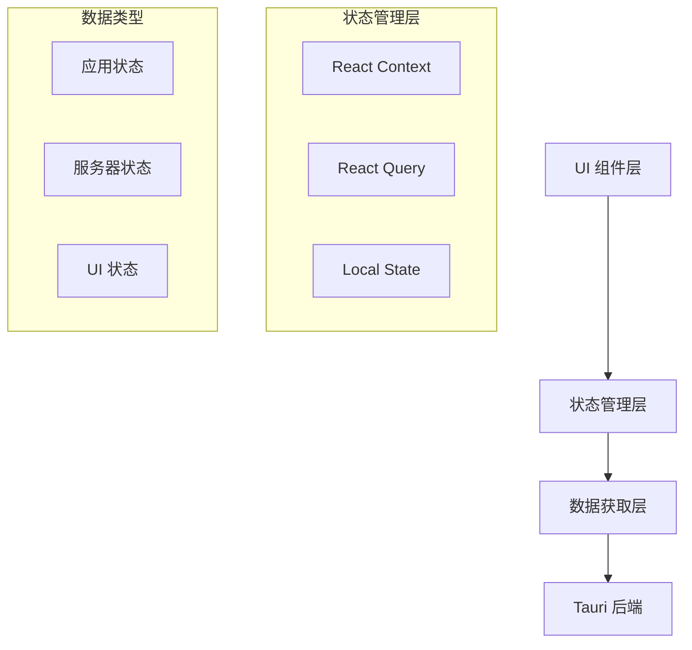

# 状态管理

CrossCopy UI 基于 Tauri + React 架构，采用现代化的状态管理方案。通过 React Context API、React Query 和自定义 Hooks 的组合，结合 Tauri 的状态同步机制，实现了高效、可靠的前后端状态管理。

## 状态管理架构

### 1. 状态分层设计

CrossCopy 采用分层的状态管理架构，将状态按照职责和生命周期进行分类：



### 2. 状态分类

#### 应用状态 (Application State)
- **全局配置**: 主题、语言、用户偏好
- **导航状态**: 当前活动视图、路由状态
- **用户会话**: 登录状态、用户信息
- **应用元数据**: 版本信息、功能开关

#### 服务器状态 (Server State)
- **剪贴板数据**: 历史记录、当前内容
- **设备信息**: 连接状态、设备列表
- **同步状态**: 同步进度、错误信息
- **配置数据**: 后端配置、系统设置

#### UI 状态 (UI State)
- **表单状态**: 输入值、验证状态
- **视图状态**: 加载状态、错误状态
- **交互状态**: 选中项、展开状态
- **临时状态**: 弹窗、提示信息

### 3. 技术栈选择

#### React Query (TanStack Query)
负责服务器状态管理：
- **数据获取**: 自动缓存和同步
- **后台更新**: 智能的后台数据刷新
- **错误处理**: 统一的错误处理机制
- **离线支持**: 离线状态下的数据管理

#### React Context
负责应用状态管理：
- **全局状态**: 跨组件的状态共享
- **主题管理**: 主题切换和持久化
- **用户偏好**: 语言、设置等用户偏好
- **应用配置**: 全局配置和功能开关

#### Local State (useState/useReducer)
负责组件内部状态：
- **表单状态**: 表单输入和验证
- **UI 交互**: 组件内部的交互状态
- **临时数据**: 不需要持久化的临时状态

## 具体实现

### 1. React Query 配置

```typescript
// React Query 客户端配置
import { QueryClient, QueryClientProvider } from '@tanstack/react-query';
import { ReactQueryDevtools } from '@tanstack/react-query-devtools';

const queryClient = new QueryClient({
  defaultOptions: {
    queries: {
      // 数据保持新鲜的时间
      staleTime: 5 * 60 * 1000, // 5分钟
      // 缓存时间
      cacheTime: 10 * 60 * 1000, // 10分钟
      // 重试配置
      retry: (failureCount, error) => {
        // 网络错误重试，其他错误不重试
        if (error.message.includes('network')) {
          return failureCount < 3;
        }
        return false;
      },
      // 后台重新获取
      refetchOnWindowFocus: true,
      refetchOnReconnect: true,
    },
    mutations: {
      // 变更重试配置
      retry: 1,
    },
  },
});

// 应用根组件
export const App: React.FC = () => {
  return (
    <QueryClientProvider client={queryClient}>
      <AppProvider>
        <ThemeProvider>
          <Router />
        </ThemeProvider>
      </AppProvider>
      <ReactQueryDevtools initialIsOpen={false} />
    </QueryClientProvider>
  );
};
```

### 2. 应用状态管理 (React Context)

```typescript
// 应用状态类型定义
interface AppState {
  activeView: string;
  isOnline: boolean;
  notifications: Notification[];
  user: User | null;
}

interface AppContextType {
  state: AppState;
  actions: {
    setActiveView: (view: string) => void;
    setOnlineStatus: (online: boolean) => void;
    addNotification: (notification: Notification) => void;
    removeNotification: (id: string) => void;
    setUser: (user: User | null) => void;
  };
}

// 应用状态 Reducer
const appReducer = (state: AppState, action: AppAction): AppState => {
  switch (action.type) {
    case 'SET_ACTIVE_VIEW':
      return { ...state, activeView: action.payload };

    case 'SET_ONLINE_STATUS':
      return { ...state, isOnline: action.payload };

    case 'ADD_NOTIFICATION':
      return {
        ...state,
        notifications: [...state.notifications, action.payload],
      };

    case 'REMOVE_NOTIFICATION':
      return {
        ...state,
        notifications: state.notifications.filter(n => n.id !== action.payload),
      };

    case 'SET_USER':
      return { ...state, user: action.payload };

    default:
      return state;
  }
};

// 应用状态提供者
export const AppProvider: React.FC<{ children: React.ReactNode }> = ({ children }) => {
  const [state, dispatch] = useReducer(appReducer, {
    activeView: 'clipboard',
    isOnline: true,
    notifications: [],
    user: null,
  });

  // 初始化应用状态
  useEffect(() => {
    const initializeApp = async () => {
      try {
        // 从 Tauri 后端获取初始状态
        const savedView = await invoke('get_last_active_view');
        dispatch({ type: 'SET_ACTIVE_VIEW', payload: savedView });

        // 监听网络状态
        const unlisten = await listen('network-status-changed', (event) => {
          dispatch({ type: 'SET_ONLINE_STATUS', payload: event.payload });
        });

        return unlisten;
      } catch (error) {
        console.error('Failed to initialize app:', error);
      }
    };

    initializeApp();
  }, []);

  // 动作创建器
  const actions = useMemo(() => ({
    setActiveView: (view: string) => {
      dispatch({ type: 'SET_ACTIVE_VIEW', payload: view });
      // 保存到后端
      invoke('save_active_view', { view }).catch(console.error);
    },

    setOnlineStatus: (online: boolean) => {
      dispatch({ type: 'SET_ONLINE_STATUS', payload: online });
    },

    addNotification: (notification: Notification) => {
      dispatch({ type: 'ADD_NOTIFICATION', payload: notification });
      // 自动移除通知
      setTimeout(() => {
        dispatch({ type: 'REMOVE_NOTIFICATION', payload: notification.id });
      }, notification.duration || 5000);
    },

    removeNotification: (id: string) => {
      dispatch({ type: 'REMOVE_NOTIFICATION', payload: id });
    },

    setUser: (user: User | null) => {
      dispatch({ type: 'SET_USER', payload: user });
    },
  }), []);

  const value = { state, actions };

  return <AppContext.Provider value={value}>{children}</AppContext.Provider>;
};
```

### 3. 服务器状态管理 (React Query)

```typescript
// 剪贴板数据查询
export const useClipboardHistory = (options?: {
  limit?: number;
  filter?: string;
}) => {
  return useQuery({
    queryKey: ['clipboard-history', options],
    queryFn: async () => {
      return await invoke('get_clipboard_history', options);
    },
    // 每30秒自动刷新
    refetchInterval: 30000,
    // 窗口获得焦点时刷新
    refetchOnWindowFocus: true,
  });
};

// 设备列表查询
export const useDevices = () => {
  return useQuery({
    queryKey: ['devices'],
    queryFn: async () => {
      return await invoke('get_devices');
    },
    // 每5秒刷新设备状态
    refetchInterval: 5000,
  });
};

// 剪贴板操作变更
export const useClipboardMutations = () => {
  const queryClient = useQueryClient();

  const addItem = useMutation({
    mutationFn: async (content: ClipboardContent) => {
      return await invoke('add_clipboard_item', { content });
    },
    onSuccess: () => {
      // 刷新剪贴板历史
      queryClient.invalidateQueries({ queryKey: ['clipboard-history'] });
    },
    onError: (error) => {
      console.error('Failed to add clipboard item:', error);
    },
  });

  const deleteItem = useMutation({
    mutationFn: async (itemId: string) => {
      return await invoke('delete_clipboard_item', { itemId });
    },
    onMutate: async (itemId) => {
      // 乐观更新
      await queryClient.cancelQueries({ queryKey: ['clipboard-history'] });

      const previousHistory = queryClient.getQueryData(['clipboard-history']);

      queryClient.setQueryData(['clipboard-history'], (old: ClipboardItem[]) => {
        return old?.filter(item => item.id !== itemId) || [];
      });

      return { previousHistory };
    },
    onError: (err, itemId, context) => {
      // 回滚乐观更新
      queryClient.setQueryData(['clipboard-history'], context?.previousHistory);
    },
    onSettled: () => {
      // 重新获取数据
      queryClient.invalidateQueries({ queryKey: ['clipboard-history'] });
    },
  });

  return { addItem, deleteItem };
};
```

### 4. 自定义状态 Hooks

```typescript
// 应用状态 Hook
export const useAppState = () => {
  const context = useContext(AppContext);
  if (!context) {
    throw new Error('useAppState must be used within AppProvider');
  }
  return context;
};

// 通知管理 Hook
export const useNotifications = () => {
  const { state, actions } = useAppState();

  const showSuccess = useCallback((message: string) => {
    actions.addNotification({
      id: Date.now().toString(),
      type: 'success',
      message,
      duration: 3000,
    });
  }, [actions]);

  const showError = useCallback((message: string) => {
    actions.addNotification({
      id: Date.now().toString(),
      type: 'error',
      message,
      duration: 5000,
    });
  }, [actions]);

  const showInfo = useCallback((message: string) => {
    actions.addNotification({
      id: Date.now().toString(),
      type: 'info',
      message,
      duration: 4000,
    });
  }, [actions]);

  return {
    notifications: state.notifications,
    showSuccess,
    showError,
    showInfo,
    removeNotification: actions.removeNotification,
  };
};

// 在线状态 Hook
export const useOnlineStatus = () => {
  const { state, actions } = useAppState();

  useEffect(() => {
    const handleOnline = () => actions.setOnlineStatus(true);
    const handleOffline = () => actions.setOnlineStatus(false);

    window.addEventListener('online', handleOnline);
    window.addEventListener('offline', handleOffline);

    return () => {
      window.removeEventListener('online', handleOnline);
      window.removeEventListener('offline', handleOffline);
    };
  }, [actions]);

  return state.isOnline;
};
```

## 状态同步策略

### 1. 前后端状态同步

```typescript
// 状态同步管理器
class StateSyncManager {
  private eventListeners: Map<string, UnlistenFn> = new Map();

  constructor(private queryClient: QueryClient) {}

  // 初始化事件监听
  async initialize() {
    // 监听剪贴板更新
    const clipboardUnlisten = await listen('clipboard-updated', () => {
      this.queryClient.invalidateQueries({ queryKey: ['clipboard-history'] });
    });
    this.eventListeners.set('clipboard', clipboardUnlisten);

    // 监听设备状态变化
    const deviceUnlisten = await listen('device-status-changed', () => {
      this.queryClient.invalidateQueries({ queryKey: ['devices'] });
    });
    this.eventListeners.set('device', deviceUnlisten);

    // 监听设置更新
    const settingsUnlisten = await listen('settings-updated', (event) => {
      this.queryClient.setQueryData(['settings'], event.payload);
    });
    this.eventListeners.set('settings', settingsUnlisten);
  }

  // 清理事件监听
  cleanup() {
    this.eventListeners.forEach(unlisten => unlisten());
    this.eventListeners.clear();
  }
}

// 在应用中使用
export const useStateSyncManager = () => {
  const queryClient = useQueryClient();

  useEffect(() => {
    const syncManager = new StateSyncManager(queryClient);
    syncManager.initialize();

    return () => syncManager.cleanup();
  }, [queryClient]);
};
```

### 2. 离线状态处理

```typescript
// 离线状态管理
export const useOfflineSupport = () => {
  const queryClient = useQueryClient();
  const isOnline = useOnlineStatus();

  useEffect(() => {
    if (isOnline) {
      // 重新连接时刷新所有查询
      queryClient.refetchQueries();
    } else {
      // 离线时暂停所有查询
      queryClient.getQueryCache().getAll().forEach(query => {
        query.cancel();
      });
    }
  }, [isOnline, queryClient]);

  // 离线时的数据操作队列
  const [offlineQueue, setOfflineQueue] = useState<OfflineOperation[]>([]);

  const addToOfflineQueue = useCallback((operation: OfflineOperation) => {
    if (!isOnline) {
      setOfflineQueue(prev => [...prev, operation]);
    }
  }, [isOnline]);

  // 重新连接时处理离线队列
  useEffect(() => {
    if (isOnline && offlineQueue.length > 0) {
      const processQueue = async () => {
        for (const operation of offlineQueue) {
          try {
            await operation.execute();
          } catch (error) {
            console.error('Failed to execute offline operation:', error);
          }
        }
        setOfflineQueue([]);
      };

      processQueue();
    }
  }, [isOnline, offlineQueue]);

  return { addToOfflineQueue, offlineQueueLength: offlineQueue.length };
};
```

## 性能优化

### 1. 选择性重渲染

```typescript
// 使用 React.memo 优化组件渲染
const ClipboardItem = React.memo<ClipboardItemProps>(({ item, onDelete }) => {
  return (
    <div className="clipboard-item">
      <span>{item.content}</span>
      <button onClick={() => onDelete(item.id)}>删除</button>
    </div>
  );
}, (prevProps, nextProps) => {
  // 自定义比较函数
  return prevProps.item.id === nextProps.item.id &&
         prevProps.item.content === nextProps.item.content;
});

// 使用 useMemo 优化计算
const ClipboardList: React.FC<{ items: ClipboardItem[] }> = ({ items }) => {
  const filteredItems = useMemo(() => {
    return items.filter(item => item.content.length > 0);
  }, [items]);

  const itemCount = useMemo(() => filteredItems.length, [filteredItems]);

  return (
    <div>
      <p>共 {itemCount} 项</p>
      {filteredItems.map(item => (
        <ClipboardItem key={item.id} item={item} />
      ))}
    </div>
  );
};
```

### 2. 虚拟滚动优化

```typescript
// 大列表虚拟滚动
import { FixedSizeList as List } from 'react-window';

const VirtualizedClipboardList: React.FC<{ items: ClipboardItem[] }> = ({ items }) => {
  const Row = useCallback(({ index, style }: { index: number; style: React.CSSProperties }) => (
    <div style={style}>
      <ClipboardItem item={items[index]} />
    </div>
  ), [items]);

  return (
    <List
      height={600}
      itemCount={items.length}
      itemSize={80}
      width="100%"
    >
      {Row}
    </List>
  );
};
```

### 3. 状态更新优化

```typescript
// 批量状态更新
export const useBatchedUpdates = () => {
  const [pendingUpdates, setPendingUpdates] = useState<StateUpdate[]>([]);

  const batchUpdate = useCallback((update: StateUpdate) => {
    setPendingUpdates(prev => [...prev, update]);
  }, []);

  // 使用 requestIdleCallback 在空闲时批量处理
  useEffect(() => {
    if (pendingUpdates.length === 0) return;

    const processUpdates = (deadline: IdleDeadline) => {
      while (deadline.timeRemaining() > 0 && pendingUpdates.length > 0) {
        const update = pendingUpdates.shift();
        if (update) {
          update.execute();
        }
      }

      if (pendingUpdates.length > 0) {
        requestIdleCallback(processUpdates);
      }
    };

    requestIdleCallback(processUpdates);
  }, [pendingUpdates]);

  return { batchUpdate };
};
```

## 最佳实践

### 1. 状态设计原则

- **单一数据源**: 每个状态只有一个权威来源
- **不可变性**: 使用不可变的状态更新模式
- **最小化状态**: 只存储必要的状态，其他数据通过计算得出
- **状态归一化**: 复杂数据结构使用归一化存储

### 2. 错误处理

```typescript
// 全局错误边界
class StateErrorBoundary extends React.Component<
  { children: React.ReactNode },
  { hasError: boolean; error?: Error }
> {
  constructor(props: { children: React.ReactNode }) {
    super(props);
    this.state = { hasError: false };
  }

  static getDerivedStateFromError(error: Error) {
    return { hasError: true, error };
  }

  componentDidCatch(error: Error, errorInfo: React.ErrorInfo) {
    console.error('State error:', error, errorInfo);
    // 发送错误报告到后端
    invoke('report_error', { error: error.message, stack: error.stack });
  }

  render() {
    if (this.state.hasError) {
      return (
        <div className="error-fallback">
          <h2>状态管理出现错误</h2>
          <button onClick={() => this.setState({ hasError: false })}>
            重试
          </button>
        </div>
      );
    }

    return this.props.children;
  }
}
```

### 3. 调试和监控

```typescript
// 状态调试工具
export const useStateDebugger = (stateName: string, state: any) => {
  useEffect(() => {
    if (process.env.NODE_ENV === 'development') {
      console.group(`State Update: ${stateName}`);
      console.log('New State:', state);
      console.trace();
      console.groupEnd();
    }
  }, [stateName, state]);
};

// 性能监控
export const usePerformanceMonitor = () => {
  const [metrics, setMetrics] = useState<PerformanceMetrics>({});

  const measureRender = useCallback((componentName: string) => {
    const start = performance.now();

    return () => {
      const end = performance.now();
      const duration = end - start;

      setMetrics(prev => ({
        ...prev,
        [componentName]: {
          ...prev[componentName],
          lastRenderTime: duration,
          averageRenderTime: (prev[componentName]?.averageRenderTime || 0 + duration) / 2,
        },
      }));
    };
  }, []);

  return { metrics, measureRender };
};
```
```